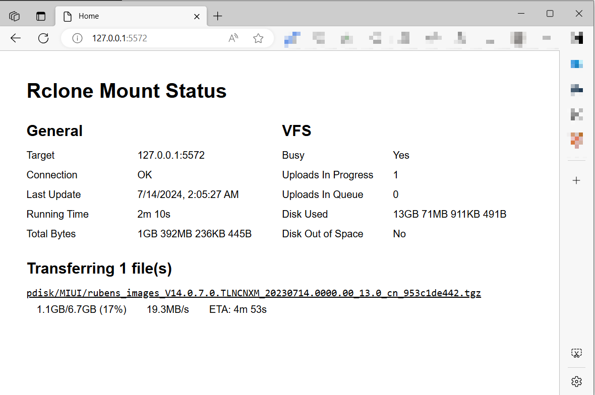

# WebUI for Rclone Mount Status

## Overview



This WebUI displays essential information about the `rclone mount` status.


## Features

* **VFS->Busy**: Indicates if `rclone mount` is uploading files
    * **Yes**:  Files are being uploaded; do not terminate `rclone`.
    * **No, safe to exit**: You can safely exit `rclone`.
* **Transferring**: Provides details on:
    * Current file transfers
    * Estimated wait time


**What this UI is not**:

* This WebUI does not execute commands or start the `rclone` process.
* It is not designed for `rclone copy`, `rclone sync`, or other commands. It is specifically for `rclone mount`.


## Deployment

1. Download the repo as `zip`

2. Extract all files to a folder, e.g. `/<webui>`. The structure should look like this:

    ```
    /<webui>
      |- js/
      |- index.html
      |- ...
    ```

3. Enable`Remote Control` for `rclone mount` by applying these options:

    ``` bash
    rclone \
    	--rc --rc-addr=127.0.0.1:5572 \
    	--rc-files="/<webui>" \
    	mount ...
    ```


## Why write this UI?

As a heavy `rclone mount` user, I found the terminal output insufficient. I needed to know which files were successfully uploaded and when it was safe to exit the program. Despite extensive searching, I couldn't find a satisfactory solution.

Relevant discussions include:

* [How to check mount upload progress from scripts?](https://forum.rclone.org/t/how-to-check-mount-upload-progress-from-scripts/27396)
* [RClone mount show progress on copy/move windows](https://forum.rclone.org/t/rclone-mount-show-progress-on-copy-move-windows/31715)
* [How to know when a mount is done syncing changes?](https://forum.rclone.org/t/how-to-know-when-a-mount-is-done-syncing-changes/28513)
* [Query rclone mount VFS stats via rclone remote control API · Issue #5816](https://github.com/rclone/rclone/issues/5816)
* [Show synchronization status in Windows Explorer · Issue #4878](https://github.com/rclone/rclone/issues/4878)

Since no direct answers were found, I created this WebUI. If you discover a better solution, please let me know. 


## License

MIT
